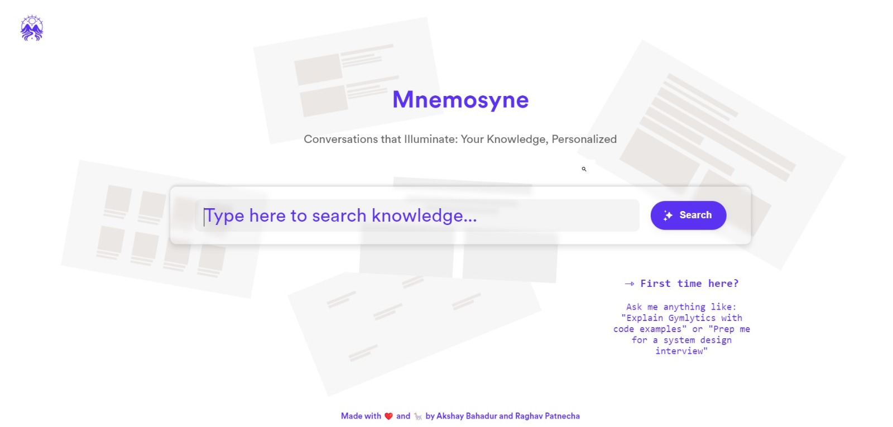

<div align="center">

<p align="center"> </p>

</div>

[](https://github.com/raghavpatnecha/Mnemosyne/blob/main/LICENSE)  [](https://github.com/raghavpatnecha) [](https://akshaybahadur.com)

# Mnemosyne
Mnemosyne is an intelligent conversational search agent for Medium articles, named after the Greek goddess of memory.

## Description 🛰️

Mnemosyne leverages Generative AI and other machine learning techniques to provide an intuitive, conversation-based interface for searching and exploring articles. Whether you're looking for specific information or wanting to dive deep into a topic, Mnemosyne acts as your personal search engine, offering relevant content and insights from a vast repository of your articles.

## Getting Started 🦄

### Installation

1. Clone the repository:
   ```
   git clone https://github.com/yourusername/mnemosyne.git
   ```
2. Code Requirements 
You can install Conda for python which resolves all the dependencies for machine learning.
   ```
   pip install -r requirements.txt
   ```

## License 🚔

This project is licensed under the MIT License - see the [LICENSE.md](LICENSE.md) file for details.

## Contact 📱

For any queries or suggestions, please open an issue on this GitHub repository or contact the maintainers directly.

## Cite Us :pushpin:

```
@article{raghavpatnecha_socratic,
author = [{Patnecha, Raghav}, {Bahadur, Akshay}],
journal = {https://github.com/raghavpatnecha/Mnemosyne},
month = {10},
title = {{Mnemosyne}},
year = {2024}
}
```

###### Made with ❤️ and 🦙 by Akshay Bahadur
---
