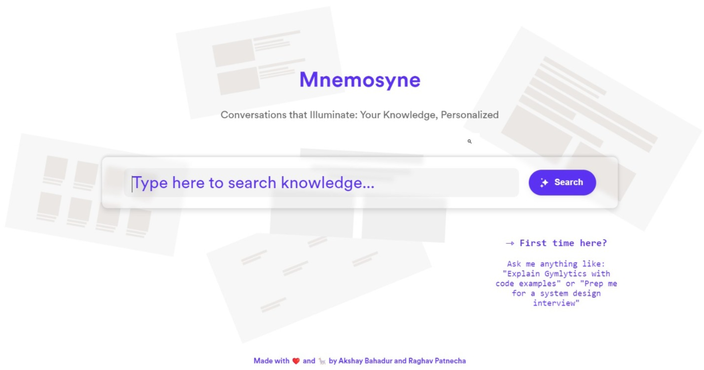

<div align="center">

<p align="center"> </p>

</div>

[](https://github.com/raghavpatnecha/Mnemosyne/blob/main/LICENSE)  [](https://github.com/raghavpatnecha) [](https://akshaybahadur.com)

# Mnemosyne

**Open-Source RAG-as-a-Service Platform**

Mnemosyne is an intelligent, production-ready RAG (Retrieval-Augmented Generation) platform that makes building AI-powered search and chat applications simple. Upload your documents, search semantically, and build conversational AI - all through a clean API and Python SDK.

## Features

- **Simple API**: Just 4 core endpoints - collections, documents, retrievals, and chat
- **Multiple Search Modes**: Semantic, keyword, hybrid, hierarchical, and graph-based (LightRAG)
- **Multimodal**: PDF, DOCX, TXT, MP4 videos, YouTube, Excel, images, and audio
- **Python SDK**: Type-safe, async-ready client library ([see SDK docs](sdk/README.md))
- **Streaming Chat**: Real-time conversational AI with RAG context
- **Self-Hostable**: Run on your infrastructure with Docker Compose
- **Production-Ready**: PostgreSQL, Redis, Celery, monitoring, and backups included

## Quick Start

### Option 1: Python SDK

```bash
pip install mnemosyne-sdk
```

```python
from mnemosyne import Client

# Initialize
client = Client(api_key="mn_...")

# Create collection
collection = client.collections.create(name="Research Papers")

# Upload document
doc = client.documents.create(
    collection_id=collection.id,
    file="paper.pdf",
    metadata={"topic": "AI"}
)

# Search (5 modes: semantic, keyword, hybrid, hierarchical, graph)
results = client.retrievals.retrieve(
    query="What are transformers?",
    mode="hybrid",
    top_k=10
)

# Chat
for chunk in client.chat.chat(message="Explain transformers", stream=True):
    print(chunk, end="")
```

See [SDK Documentation](sdk/README.md) for complete guide.

### Option 2: Self-Host with Docker

```bash
# Clone repository
git clone https://github.com/raghavpatnecha/Mnemosyne.git
cd Mnemosyne

# Configure environment
cp .env.example .env
nano .env  # Add your OpenAI API key

# Start all services
docker-compose up -d

# API available at http://localhost:8000
# Docs at http://localhost:8000/docs
```

Register a user:
```bash
curl -X POST "http://localhost:8000/api/v1/auth/register" \
  -H "Content-Type: application/json" \
  -d '{"email": "user@example.com", "password": "password"}'
```

## Documentation

- **[Getting Started](docs/user/getting-started.md)** - Quick start guide
- **[API Reference](docs/user/api-reference.md)** - Complete API specification
- **[Architecture](docs/user/architecture.md)** - System design and components
- **[Deployment](docs/user/deployment.md)** - Production deployment guide
- **[Python SDK](sdk/README.md)** - SDK documentation with examples
- **[Developer Guide](CLAUDE.md)** - Contributing and development guidelines

## Project Structure

```
mnemosyne/
├── backend/         # FastAPI RAG-as-a-Service API
│   ├── api/         # API endpoints (auth, collections, documents, retrievals, chat)
│   ├── models/      # SQLAlchemy database models
│   ├── schemas/     # Pydantic request/response models
│   ├── services/    # Business logic (LightRAG, embeddings, search)
│   ├── tasks/       # Celery background tasks
│   └── main.py      # FastAPI application entry
├── sdk/             # Python SDK for Mnemosyne API
│   ├── mnemosyne/   # SDK source code
│   └── examples/    # Usage examples
├── docs/            # Documentation
│   ├── user/        # User guides (getting started, API reference)
│   ├── developer/   # Developer docs (architecture, contributing)
│   └── archive/     # Historical planning and implementation docs
├── src/             # [DEPRECATED] Legacy Medium articles search
├── tests/           # Test suites
└── docker-compose.yml  # Full stack deployment
```

## License

This project is licensed under the MIT License - see the [LICENSE](LICENSE) file for details.

## Acknowledgments

Built with:
- [FastAPI](https://fastapi.tiangolo.com/) - Modern Python web framework
- [LightRAG](https://github.com/HKUDS/LightRAG) - Graph-based RAG
- [pgvector](https://github.com/pgvector/pgvector) - Vector similarity search for Postgres
- [Docling](https://github.com/DS4SD/docling) - Document parsing
- [Chonkie](https://github.com/chonkie-ai/chonkie) - Semantic chunking
- [LiteLLM](https://github.com/BerriAI/litellm) - Unified LLM interface

Inspired by:
- [Ragie.ai](https://ragie.ai) - API design and developer experience
- [SurfSense](https://github.com/yieldprotocol/surfsense) - Architecture patterns

## Citation

```bibtex
@software{mnemosyne2024,
  title = {Mnemosyne: Open-Source RAG-as-a-Service Platform},
  author = {Patnecha, Raghav and Bahadur, Akshay},
  year = {2024},
  url = {https://github.com/raghavpatnecha/Mnemosyne}
}
```

Made with ❤️ by [Raghav Patnecha](https://github.com/raghavpatnecha) and [Akshay Bahadur](https://akshaybahadur.com)
